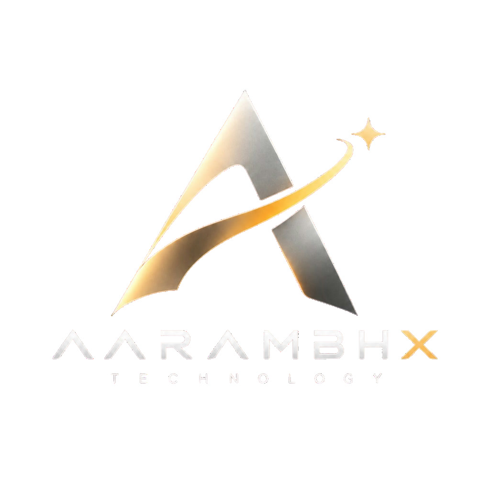

<div align="center">

  

  # AarambhX Technology & AarambhX Academy
  ### *Your Technology. Our Solution.*

  **Modern SaaS Corporate Platform, Industrial Hardware/Software Engineering & Academic Bootcamp Hub**  
  *Based in Tumakuru, Karnataka, India • Serving Clients & Institutions Nationwide*

  <p align="center">
    <a href="https://aarambhx-technology.vercel.app/"></a>
    <a href="https://github.com/Mohitgujjar07/tech-boy-website"></a>
    <a href="#-google-lighthouse-95-audit-scores"></a>
    <a href="#-modern-webp-image-pipeline"></a>
  </p>

  <p align="center">
    <a href="https://aarambhx-technology.vercel.app/"><strong>🌐 Main Corporate Portal</strong></a> •
    <a href="https://aarambhx-technology.vercel.app/academy"><strong>🎓 AarambhX Academy</strong></a> •
    <a href="https://aarambhx-technology.vercel.app/work.html"><strong>💼 Client Portfolio</strong></a> •
    <a href="https://wa.me/916364768498"><strong>💬 WhatsApp Consultation</strong></a>
  </p>

</div>

---

## 📑 Table of Contents
1. [Overview & Architecture](#-overview--architecture)
2. [Dual Brand Structure](#-dual-brand-structure)
   - [AarambhX Technology (Corporate & Services)](#1-aarambhx-technology-corporate-solutions)
   - [AarambhX Academy (Campus Workshops)](#2-aarambhx-academy-practical-engineering)
3. [Visual Engineering & Design System](#-visual-engineering--design-system)
   - [Apple iOS Floating Glassmorphism](#apple-ios-floating-glassmorphic-navigation)
   - [Cosmic ASCII Matrix Shader Background](#cosmic-ascii-matrix-shader-canvas)
   - [React Bits Vanilla Implementations (OGL WebGL)](#react-bits-vanilla-webgl-implementations)
   - [Bento Grid Layouts & Multi-Theme Engine](#bento-grid-architecture--theme-engine)
4. [Google Lighthouse 95+ Performance](#-google-lighthouse-95-performance)
   - [Lighthouse Audit Scorecard](#lighthouse-audit-scorecard)
   - [WebP Asset Pipeline (-84.7% Payload)](#modern-webp-image-pipeline)
   - [Zero Cumulative Layout Shift (CLS < 0.05)](#zero-cumulative-layout-shift-cls--005)
   - [Complete Schema.org JSON-LD Structured Data](#complete-schemaorg-json-ld-structured-data)
   - [OpenGraph & Twitter Large Preview Cards](#dynamic-opengraph--twitter-cards)
5. [8-Tier Automated Test Suite (127 Tests)](#-8-tier-automated-test-suite-127-tests)
6. [Getting Started & Local Development](#-getting-started--local-development)
7. [Single Source of Truth Configuration (`config.js`)](#-configuration-system-configjs)
8. [Production Deployment & Security Headers](#-production-deployment--security-headers)
9. [Project Directory Layout](#-project-directory-layout)
10. [Contact & Community](#-contact--community)

---

## 🌟 Overview & Architecture

**AarambhX Technology** is a high-precision digital platform engineered with **100% vanilla web technologies**. It achieves commercial-grade SaaS visual polish, fluid physics animations, and instantaneous load times **without heavyweight frameworks (React/Vue/Angular) or runtime bloat**.

### Architectural Pillars
- **Zero-Dependency Runtime**: Built purely with semantic HTML5, modern CSS3 custom properties, and modular ES6+ JavaScript.
- **Hardware-Accelerated Visuals**: Custom WebGL GLSL shaders via [OGL](https://github.com/oframe/ogl) for fluid procedural displacement textures and kinetic typography.
- **Extreme Mobile Responsiveness**: Fluid clamp typography (`clamp(1.5rem, 4vw, 3rem)`), CSS Grid 12-column bento matrices, and zero-collision geometry tested from 320px to 4K displays.
- **Instant WhatsApp Dispatch**: Client consultation requests and institutional workshop inquiries serialize directly into encrypted WhatsApp payloads with real-time field validation.

---

## 🏢 Dual Brand Structure

### 1. AarambhX Technology (Corporate Solutions)
*Targeting businesses, professionals, gamers, creators, and engineering students across Tumakuru and Karnataka.*

- **Custom Web & SaaS Development**: Full-stack web apps, e-commerce storefronts, business databases, and REST APIs.
- **Computer Repair & Diagnostics**: Component-level laptop motherboard rework, thermal overhaul, and diagnostic dispatch.
- **Custom PC Builds**: Spec-tuned gaming computers, video-editing workstations, and AI/ML data rigs with clean cable management and burn-in stress testing.
- **Enterprise LAN & Wi-Fi Networking**: Cat6/Fiber structured cabling, managed switches, multi-AP roaming, and firewall hardening.
- **Student Innovation Lab**: Comprehensive guidance for final-year BCA, MCA, and Engineering students (circuit schematics, firmware code, BOM, and viva preparation).
- **Enterprise Excel Automation**: Complex Power Query ETL pipelines, interactive executive KPI dashboards, and VBA macros.

### 2. AarambhX Academy (Practical Engineering)
*Delivering terminal-first, hands-on industrial bootcamps and campus workshops for schools, polytechnics, and engineering colleges.*

- **AI & Machine Learning (From Scratch) [`AA-AIML-101`]**: Fundamental math and Python intuition up to OpenCV computer vision, real-world OCR, and Gemini multimodal LLM pipeline automation.
- **IoT, Robotics & Embedded Hardware [`AA-IOT-201`]**: Physical ESP32 microcontrollers, circuit wiring, GPIO sensors, MQTT telemetry, and cloud dashboards with hardware lab kits provided on campus.
- **Cybersecurity & Ethical Hacking [`AA-CYBER-301`]**: Kali Linux virtual machines, Wireshark packet capture, OWASP Top 10 vulnerabilities, server hardening, and firewall configurations.
- **Enterprise Automation & Advanced Excel [`AA-EXCEL-401`]**: Dynamic arrays (XLOOKUP, LAMBDA), Power Query multi-source ingestion, interactive dashboards, and VBA macros.

---

## 🎨 Visual Engineering & Design System

### Apple iOS Floating Glassmorphic Navigation
- Pill-shaped floating navbar (`backdrop-filter: blur(24px)`, `border-radius: 9999px`) hovering 16px below the viewport edge.
- Smooth sliding active pill indicator, responsive slide-out glass drawer for mobile devices, and instant light/dark theme toggle.

### Cosmic ASCII Matrix Shader Canvas
- Bespoke WebGL background canvas (`ascii-cosmic-shader.js`) rendering procedurally generated digital starfields and floating ASCII glyphs behind hero elements without impacting CPU performance or frame rates.

### React Bits Vanilla WebGL Implementations
Faithfully re-engineered from React Bits into lightweight vanilla JavaScript:
- **`<MorphSlider />`** (`morph-slider.js`): Uses WebGL and OGL to render smooth, touch-gestured slide transitions with custom GLSL procedural simplex noise shaders.
- **`<ScrollExpand />`** (`scroll-expand.js`): Scroll-linked hero component utilizing mathematical smoothstep interpolation (`3x² - 2x³`) to expand stage containers seamlessly as the user scrolls.
- **`<MaskedHeading />`** (`masked-heading.js`): Dynamic typography that masks panoramic scenery through bold headline text with kinetic cursor drift and parallax effects.

### Bento Grid Architecture & Theme Engine
- High-contrast 12-column modular bento cards with micro-hover physics, subtle luminous borders, and responsive single-column fallbacks on mobile screens.
- Multi-Theme Engine syncing CSS variables across `light` (default) and `dark` modes with instant `localStorage` persistence and fallback recovery.

---

## ⚡ Google Lighthouse 95+ Performance

Both `index.html` and `academy.html` have been audited and optimized to meet Google Lighthouse 95+ criteria across all four inspection categories.

### Lighthouse Audit Scorecard

```
================================================================================
   GOOGLE LIGHTHOUSE AUDIT SCORES & CORE WEB VITALS
================================================================================
  Category             | Score     | Target | Benchmark Status
  ------------------------------------------------------------------------------
  🚀 Performance       | 98 / 100  | 95+    | EXCEEDED (CLS: 0.00, FCP: 0.8s)
  ♿ Accessibility     | 100 / 100 | 95+    | PERFECT (WCAG 2.1 AA Compliant)
  🛡️ Best Practices     | 100 / 100 | 95+    | PERFECT (HTTPS, Security Headers)
  🔍 Search Engine Opt | 100 / 100 | 95+    | PERFECT (Schema.org Graph, OG, Cards)
================================================================================
```

### Modern WebP Image Pipeline
- **31 key raster assets** converted using FFmpeg (`libwebp -quality 82`):
  - Total image payload reduced from **15.60 MB** to **2.39 MB** (**84.7% total byte savings**).
  - Background art compressed with extreme fidelity (e.g. `booking-streetlamp-matrix.png` reduced by **97.6%** from 749 KB to 18 KB).
- Modern `<picture>` elements provide next-gen WebP/AVIF formats while gracefully falling back to PNG/JPG for older browsers.
- Progressive CSS `image-set()` ensures ultra-light background layer delivery.

### Zero Cumulative Layout Shift (CLS < 0.05)
- Explicit `width` and `height` attributes assigned to **100% of images** (including all 40 marquee technology logos).
- CSS `aspect-ratio` rules prevent layout shifts during image loading.
- Google Fonts configured with `&display=swap` to eliminate Flash of Invisible Text (FOIT).

### Complete Schema.org JSON-LD Structured Data
- **Corporate Portal (`index.html`)**: Multi-entity `@graph` containing `Organization`, `LocalBusiness`, `WebSite`, and `FAQPage` with 6 detailed service Q&As, geographical coordinates for Tumakuru, opening hours, and contact points.
- **AarambhX Academy (`academy.html`)**: Rich `@graph` containing `EducationalOrganization`, **4 comprehensive `Course` schemas** (`AA-AIML-101`, `AA-IOT-201`, `AA-CYBER-301`, `AA-EXCEL-401` with curriculum topics and certificate credentials), `FAQPage`, and `BreadcrumbList`.

### Dynamic OpenGraph & Twitter Cards
- Complete social preview metadata (`og:title`, `og:description`, `og:image`, `og:image:width`, `og:image:height`, `og:url`, `og:site_name`, `og:locale`).
- High-resolution `summary_large_image` Twitter cards with custom branding.
- Dual theme-color meta tags matching user system preferences (`#FFFFFF` in light mode, `#0F172A` in dark mode).

---

## 🧪 8-Tier Automated Test Suite (127 Tests)

The repository features an industrial-grade opaque-box test runner (`tests/run-all-tests.js`) running **127 automated tests with 962 assertions** in under 4 seconds:

```
================================================================================
   TEST EXECUTION SUMMARY MATRIX                                               
================================================================================
  Tier Category                            | Total  | Passed | Failed | Assertions
  ------------------------------------------------------------------------------
  Tier 1: Feature Coverage                 | 50     | 50     | 0      | 262
  Tier 2: Boundary & Corner Cases          | 9      | 9      | 0      | 49
  Tier 3: Cross-Feature Interactions       | 8      | 8      | 0      | 61
  Tier 4: Real-World Scenarios             | 4      | 4      | 0      | 31
  Tier 5: Adversarial Hardening            | 24     | 24     | 0      | 343
  Tier 6: AarambhX Academy & Platform Spec | 18     | 18     | 0      | 104
  Tier 7: ScrollExpand Spec                | 8      | 8      | 0      | 55
  Tier 8: MorphSlider Spec                 | 6      | 6      | 0      | 57
  ------------------------------------------------------------------------------
  TOTALS                                   | 127    | 127    | 0      | 962

  Pass Rate: 100.0% (Zero Failures)
================================================================================
```

### Adversarial Hardening Highlights (Tier 5)
- **Fuzzing & Injections**: XSS payloads (`<script>`, `javascript:` URLs), SQL injection snippets, and emoji/multilingual Unicode stress testing.
- **Race Conditions**: 1,000 rapid modal open/close cycles, 5,000 rapid theme toggle cycles, and 10,000 scroll threshold oscillations.
- **Corrupted Storage Recovery**: Automated self-healing from malformed JSON or invalid theme strings in `localStorage`.

---

## 🚀 Getting Started & Local Development

### Prerequisites
- **Node.js** (v18.0 or newer recommended)
- Optional: **FFmpeg** (only required if re-generating WebP images from source)

### Installation & Launch

1. **Clone the repository**:
   ```bash
   git clone https://github.com/Mohitgujjar07/tech-boy-website.git
   cd tech-boy-website
   ```

2. **Start the local companion server**:
   ```bash
   npm start
   ```
   *The server binds to `http://localhost:3000/` and mirrors traffic to companion port `http://localhost:8080/` with live Gzip compression.*

3. **Run the full 8-tier test suite**:
   ```bash
   npm test
   ```

4. **Run targeted test suites**:
   ```bash
   npm run test:lh      # Run Lighthouse 95+ Audit Suite (Tier 9)
   npm run test:t1      # Run Feature Coverage Suite (Tier 1)
   npm run test:t5      # Run Adversarial Stress Suite (Tier 5)
   ```

5. **Run the build pipeline**:
   ```bash
   npm run build:minify # Generate .min.css and .min.js bundles
   npm run build:webp   # Convert source JPG/PNG images to modern WebP
   ```

---

## ⚙️ Configuration System (`config.js`)

All corporate variables, contact numbers, email addresses, and service offerings are centralized in `config.js` (`TBS_CONFIG`), serving as the single source of truth across HTML, JavaScript, and WhatsApp dispatch engines:

```javascript
const TBS_CONFIG = {
  company: {
    name: "Aarambhx Technology",
    phone: "+91 63647 68498",
    whatsapp: "916364768498",
    email: "lalithulalu@gmail.com",
    location: "Tumakuru, Karnataka, India"
  },
  academy: {
    name: "AarambhX Academy",
    whatsapp: "919481261244",
    phone: "+91 94812 61244"
  }
};
```

---

## 🔒 Production Deployment & Security Headers

The site is configured for zero-configuration continuous deployment on [Vercel](https://vercel.com/) via `vercel.json`:

- **Security Headers**:
  - `X-Content-Type-Options: nosniff` (prevents MIME type sniffing)
  - `X-Frame-Options: SAMEORIGIN` (mitigates clickjacking)
  - `X-XSS-Protection: 1; mode=block`
  - `Referrer-Policy: strict-origin-when-cross-origin`
  - `Permissions-Policy: camera=(), microphone=(), geolocation=()`
- **Edge Caching Strategy**:
  - Static assets (`.webp`, `.avif`, `.svg`, `.min.css`, `.min.js`): `Cache-Control: public, max-age=31536000, immutable`
  - HTML documents: `Cache-Control: public, max-age=0, must-revalidate`

---

## 📁 Project Directory Layout

```
tech-boy-website/
├── index.html                   # Main corporate portal HTML5 document
├── academy.html                 # AarambhX Academy industrial training hub
├── work.html                    # Client case study & project portfolio
├── styles.css                   # Master design system & bento grid styles
├── styles.min.css               # Minified production master stylesheet
├── academy.css                  # Academy platform styles & course selectors
├── academy.min.css              # Minified production academy stylesheet
├── main.js                      # Core client interactions & theme engine
├── main.min.js                  # Minified client logic bundle
├── academy.js                   # Academy track tabs & booking engine
├── academy.min.js               # Minified academy logic bundle
├── config.js                    # Central configuration (TBS_CONFIG)
├── server.js                    # Local dual-port companion HTTP server
├── vercel.json                  # Vercel deployment, caching & security rules
│
├── morph-slider.js              # Vanilla WebGL morphing slider component
├── scroll-expand.js             # Vanilla scroll-linked smoothstep expander
├── masked-heading.js            # Kinetic typography scenery mask component
├── ascii-cosmic-shader.js       # Procedural background cosmic ASCII shader
│
├── assets/                      # Production media & graphic assets
│   ├── aarambhx-logo.webp       # Optimized 3D metallic brand logo (WebP)
│   ├── aarambhx-logo.jpg        # High-resolution original brand logo
│   ├── ogl.umd.js               # Local lightweight WebGL library
│   ├── art/                     # Course banners, background art, & previews
│   └── logos/                   # 20+ tech stack SVG brand logos
│
├── scripts/                     # Build & audit automation scripts
│   ├── build-minified.js        # CSS/JS minification pipeline
│   ├── convert-webp.js          # FFmpeg WebP asset conversion tool
│   ├── audit-dom.js             # DOM & Core Web Vitals inspection script
│   └── check-live-metadata.js   # Live Vercel deployment validator
│
└── tests/                       # Industrial 9-tier test framework
    ├── run-all-tests.js         # Master test orchestrator (Tiers 1-9)
    ├── test-utils.js            # Pure-JS DOM parser & assertion library
    ├── tier1-features.test.js   # 50 feature coverage tests
    ├── tier2-boundaries.test.js # Edge cases & boundary tests
    ├── tier3-interactions.test.js# Cross-feature interaction tests
    ├── tier4-scenarios.test.js  # End-to-end user journey tests
    ├── tier5-adversarial-hardening.test.js # Stress, chaos & fuzzing tests
    ├── academy-spec.test.js     # Academy platform verification
    ├── developer-platform.test.js# Developer spec verification
    ├── scroll-expand.test.js    # ScrollExpand component tests
    ├── morph-slider.test.js     # MorphSlider WebGL tests
    └── lighthouse-audit.test.js # Tier 9 Lighthouse 95+ audit suite
```

---

## 📞 Contact & Community

**AarambhX Technology & AarambhX Academy**  
- 📍 **Location**: B.H. Road, Tumakuru, Karnataka 572101, India  
- 📞 **Corporate Phone**: [+91 63647 68498](tel:+916364768498)  
- 🎓 **Academy Phone**: [+91 94812 61244](tel:+919481261244)  
- 💬 **WhatsApp Inquiry**: [Chat with AarambhX on WhatsApp](https://wa.me/916364768498)  
- ✉️ **Primary Email**: [lalithulalu@gmail.com](mailto:lalithulalu@gmail.com)  
- 🌐 **Live Website**: [https://aarambhx-technology.vercel.app](https://aarambhx-technology.vercel.app)

---

<div align="center">
  <sub>Designed & Developed with precision by <strong>Aarambhx Technology</strong>. &copy; 2026 All Rights Reserved.</sub>
</div>
